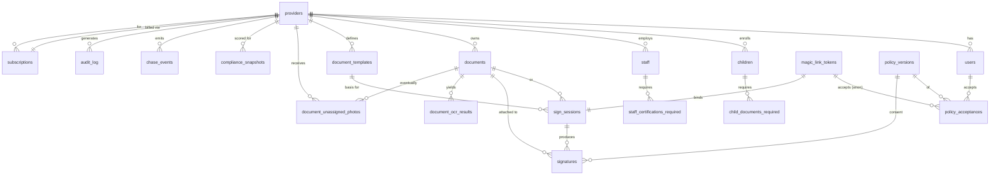

# ComplianceKit — Database Schema

This document is a narrative tour of the Postgres schema. For authoritative
definitions, always read the migration files in `backend/migrations/`.

## Conventions

- **Postgres 16**, managed on DigitalOcean.
- **Every ID is `TEXT PRIMARY KEY`** holding a 26-char base62 string (32
  random bytes base62-encoded, generated by the Go backend). Rationale:
  URL-safe, double-clickable, collision-resistant without the size of
  UUIDv4, and opaque to customers.
- **Every table has** `created_at TIMESTAMPTZ NOT NULL DEFAULT NOW()` and
  `updated_at TIMESTAMPTZ NOT NULL DEFAULT NOW()` maintained by the
  `set_updated_at()` trigger.
- **Soft-deletable tables** additionally have `deleted_at TIMESTAMPTZ NULL`.
  All read queries filter `WHERE deleted_at IS NULL`.
- **Enums** are expressed as `TEXT` + `CHECK` constraint, not native
  Postgres `ENUM` types. Trivially extensible via migration.
- **Emails** are `CITEXT` (case-insensitive).
- **Tenancy** is enforced by always filtering on `provider_id` (there is
  no row-level security; the application is responsible).

## ERD (mermaid)

## Table-by-table

### `providers` (000001)

One row per licensed child-care facility. This is the **tenant boundary**.
Every other tenant-scoped table carries `provider_id`. `state` is the
licensing jurisdiction (drives which regulatory rules apply); `state_abbr`
is the mailing address state. Soft-deletable: when a customer churns we
flip `deleted_at` and keep their data in cold read-only mode for the
retention period before hard-purging (see below).

### `users` (000001)

Humans who log in (owner/admin, staff admins). Passwordless auth — there
is no `password_hash`. Email is `CITEXT` with a global `UNIQUE` index, so
a single person with multiple jobs at different providers cannot share one
address (acceptable tradeoff: we require separate invite addresses). The
role vocabulary is deliberately tight — `provider_admin` or
`provider_staff`. Platform-level admins (Anthropic staff debugging a
customer) go through a separate impersonation flow, not a super-admin role.

### `magic_link_tokens` (000001)

Every passwordless interaction passes through this table: owner signin,
staff signup invite, parent document upload link, document signing link.
Raw tokens are **never** stored — only `sha256(token_raw)` as `BYTEA`. The
raw token is delivered via email/SMS and never persisted after the send
callback. `subject_id` is polymorphic (no FK) and its meaning depends on
`kind`:

| kind                | subject_id points to       |
|---------------------|----------------------------|
| `provider_signup`   | `providers.id` (pre-activation) |
| `provider_signin`   | `users.id`                 |
| `parent_upload`     | `children.id`              |
| `staff_upload`      | `staff.id`                 |
| `document_sign`     | `sign_sessions.id`         |

### `children` + `child_documents_required` (000002)

A child is attached to one provider, has a JSONB `guardians` array
(variable shape — 1-4 entries, custody edge cases), and gets a
`child_documents_required` checklist row per state-mandated document. The
checklist is seeded by the application from a state/age template and its
`status` is the heartbeat of the compliance dashboard.

### `staff` + `staff_certifications_required` (000003)

Symmetric to children. Staff certifications have expirations and trigger
the majority of chase events (CPR expires annually, background renewals,
etc.).

### `documents`, `document_ocr_results`, `document_unassigned_photos` (000004)

`documents` is the canonical file index — S3 holds bytes, Postgres holds
metadata + extraction results. `owner_kind` + `owner_id` is polymorphic
(child/staff/facility) — no FK; integrity enforced in application code.
Unique-per-provider on `sha256` deduplicates accidental re-uploads.

`document_ocr_results` holds raw model output. When we dual-run Mistral
and Gemini for high-confidence extraction, both rows are preserved for
offline accuracy analysis.

`document_unassigned_photos` is the "parent snapped a photo at the
pediatrician's desk" inbox. Provider triages these in the UI and the
assigned row points at the resulting `documents` row.

### `document_templates`, `sign_sessions`, `signatures` (000005)

Implements the `pdfsign` Go package.

- `document_templates` — blank forms with overlay field metadata.
- `sign_sessions` — one per signature request; bound 1:1 to a
  `magic_link_tokens` row; must reference exactly one of
  `document_template_id` or `document_id` (enforced by CHECK).
- `signatures` — immutable post-signing ledger entry with before/after
  SHA-256s and S3 pointers for both the signed PDF and the audit-trail
  PDF. `consent_version_id` FKs to `policy_versions` so we always know
  which ESIGN disclosure was in effect.

### `compliance_snapshots`, `chase_events`, `notification_suppressions` (000006)

- `compliance_snapshots` — periodic score 0-100 with a full per-provider
  findings JSON. Recomputed on document change AND on a nightly cron.
- `chase_events` — every outbound nag. Partial unique index prevents
  firing the same `(target, doc_type, trigger, channel)` twice.
- `notification_suppressions` — hard-stop list consulted at send time
  (SES complaint, Twilio STOP, explicit unsubscribe).

### `subscriptions`, `stripe_events`, `policy_versions`, `policy_acceptances` (000007)

- `subscriptions` — mirrored Stripe state, UNIQUE on `provider_id`.
- `stripe_events` — raw webhook log keyed by `stripe_event_id` for
  idempotency. `processed_at` NULL = work queue.
- `policy_versions` — every version of every legal doc ever shown, with
  content URL + SHA-256 fingerprint. Never deleted.
- `policy_acceptances` — immutable record of agreement. Either `user_id`
  or `magic_link_token_id` must be set (anonymous parent accepts via
  magic link don't have a user row).

### `audit_log` (000008)

Append-only. Written by every mutating handler. `provider_id` FK is
`ON DELETE SET NULL` so tenant purge preserves the (now-anonymized) event
history. `actor_kind`+`actor_id` is polymorphic (no FK) so webhook
identifiers and system-cron actors fit.

## Retention policy

| Table                     | Retention                   | Why                                  |
|---------------------------|-----------------------------|--------------------------------------|
| `audit_log`               | **7 years**                 | Company policy; many states require 3-5 for child care records — we round up. |
| `signatures`              | **Forever**                 | ESIGN legal evidence.                |
| `policy_versions`         | **Forever**                 | Needed to interpret historical signatures/acceptances. |
| `policy_acceptances`      | **7 years**                 | Matches audit_log.                   |
| `compliance_snapshots`    | **3 years**                 | Pre-aggregated history for dashboards; older than 3yr is drop. |
| `chase_events`            | **2 years**                 | Deliverability debugging; regulators don't ask about marketing nags. |
| `magic_link_tokens`       | **30 days post-consumption** | Rolling purge job. Consumed tokens have no forensic value beyond 30d. |
| `stripe_events`           | **2 years**                 | Matches Stripe retention.            |
| `document_unassigned_photos` (assigned) | **90 days post-assign** | Original photo is already in `documents`; this is just the staging metadata. |
| Documents for churned providers | **90-day grace, then purge** | Hard delete S3 + rows after the grace period unless legal hold. |

Retention is enforced by a nightly Go job (`cmd/ckworker retention`) not by
the database. Hard-delete happens via batched `DELETE ... RETURNING` with
matching S3 deletions in the same transaction boundary.

## Indexing philosophy

- Partial indexes where `deleted_at IS NULL` for soft-deletable hot paths.
- Composite `(provider_id, …)` indexes so tenant-scoped queries never
  table-scan.
- One UNIQUE dedupe index per chase/document to prevent write amplification
  during retries.

## Things intentionally NOT in schema

- **Row-level security.** Tenant isolation is enforced in the repository
  layer. RLS would complicate the managed DB + pgbouncer setup we plan.
- **Native Postgres ENUM types.** We use `CHECK` constraints instead.
- **Materialized views for the dashboard.** `compliance_snapshots` is our
  materialization — explicit, not magical.
- **Table partitioning on `audit_log`.** Deferred until the table exceeds
  ~50GB. At MVP scale (projected <10M rows/year) the planner's bitmap
  index scans are fine.
